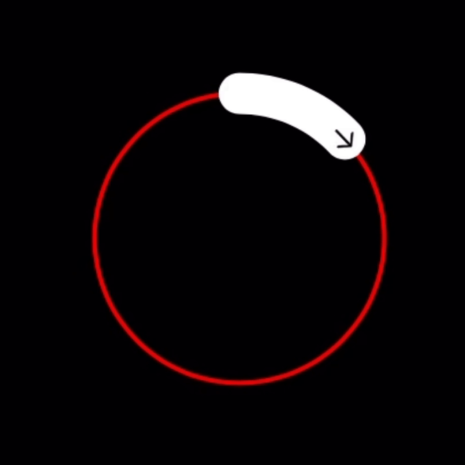

## FKProgressCircle

<p align="center">

</p>

FKProgressCircle is a lightweight library for rendering circular progress with an icon(arrow) as value indicator.

## Installation

### Cocoapods

Simply add this library on your Podfile, and then do the ```pod install``` command

```pod 'FKProgressCircle', :git => "https://github.com/fuadkhairi/FKProgressCircle.git"```

## Usage

```swift
// add FKProgressCircle to your view, its up to you for using outlet or programmatically
@IBOutlet weak var fkProgress: FKProgressCircle!

// set your custom arrow image
fkProgress.arrowImage = UIImage(systemName: "arrow.right")

// set your progress trail color
fkProgress.progressColor = .white

// set the track color of progress
fkProgress.trackColor = .red

// set the duration to fill the progress value
fkProgress.duration = 3.0

// set your progress value (0 to 1.0)
fkProgress.setProgressValue(value: 0.75)
```
